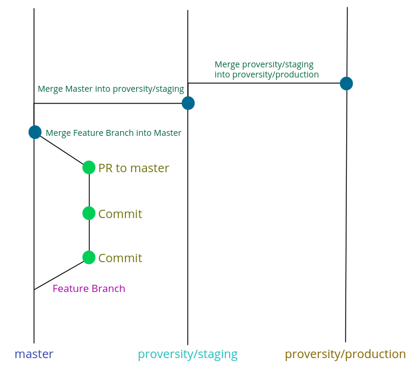

# Proversity Comprehensive Themes

This repository contains comprehensive themes for Proversity OPen edX instances.

You should follow the following branching strategy.

1. Develop your changes on a feature branch
2. Open a PR to Master for review
3. Once merged into master, merge to proversity/staging for staging deployment,
4. Then merge from proversity/staging to proversity/production for release

There's a Google Doc on [Theming Deployment](https://docs.google.com/document/d/1x6io7-STcPpSw6ieXhJfIh9N-mhVoZdgFw5MaHFsshI/edit?usp=sharing) which will be useful for deployments.